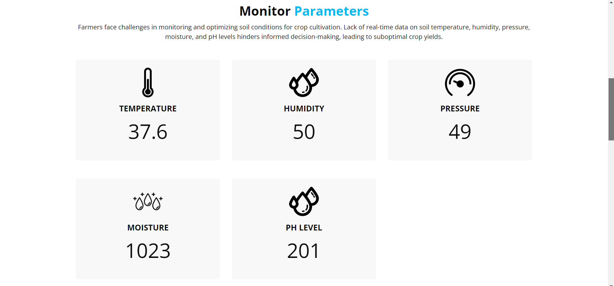
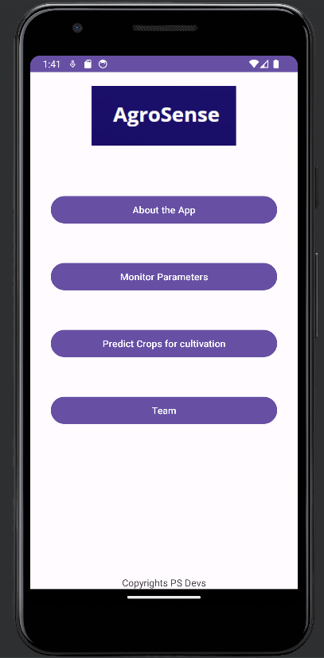

# AgroSense 🌾  
**Smart Farming and Crop Management using IoT, ML, and Database Integration**  

AgroSense is an innovative solution aimed at empowering farmers with real-time soil monitoring and crop management. By integrating IoT, machine learning, and a seamless multi-platform interface, AgroSense helps optimize farming decisions and boost crop yields.

---

## 🌟 Key Features  
- **Real-Time Monitoring:**  
  Arduino-based soil sensors measure critical parameters like temperature, humidity, pressure, moisture, and pH levels.  
- **Seamless Data Management:**  
  Sensor data is stored securely on **Firebase** for real-time access.  
- **Mobile and Web Accessibility:**  
  Intuitive **Kotlin mobile app** and a **responsive web platform** for user interaction.  
- **AI-Powered Insights:**  
  A **machine learning model hosted on Streamlit** provides actionable recommendations for optimal farming.  

---

## 🚜 The Problem  
Farmers often struggle with:  
- Limited real-time data on soil conditions.  
- Difficulty in making data-driven decisions for crop cultivation.  
- Suboptimal yields due to inefficient soil and crop management practices.  

---

## ✅ The Solution  
AgroSense bridges the gap by providing a holistic solution:  
- **Real-time sensor data** for informed decision-making.  
- **Machine learning insights** for tailored crop management strategies.  
- **User-friendly interfaces** for easy access to farming insights.  

---

## 📷 Screenshots  
**Sensor Monitoring Dashboard**  
  

**Android Application**  
  

---

## 🛠️ Tech Stack  
### Hardware  
- **ESP8266**: For interfacing soil sensors.  
- **Sensors**: Temperature, humidity, pressure, moisture, and pH.  

### Software  
- **IoT Integration**: ESP8266 gathers and sends data to Firebase.  
- **Database**: Firebase Realtime Database for secure and efficient data storage.  
- **Mobile App**: Built with **Kotlin** for cross-platform compatibility.  
- **Web Platform**: A responsive web app made with **HTML, CSS and JS** for desktop users.  
- **Machine Learning**: Streamlit-hosted ML model for predictive insights.  

---

## 🚀 How It Works  
1. **Data Collection:**  
   Soil sensors connected to Arduino capture environmental data.  
2. **Data Transmission:**  
   The Arduino sends data to Firebase in real-time.  
3. **Data Analysis:**  
   The machine learning model hosted on Gradio analyzes the data to provide actionable insights.  
4. **User Interaction:**  
   Farmers access the data and insights via the mobile app or web platform.  

---
## Made With ❤️  
AgroSense is crafted with love and dedication by [S R Pranav Suriya](https://github.com/pranavsuriya-sr).  
Empowering farmers and promoting sustainable agriculture, one innovation at a time. 🌱  
